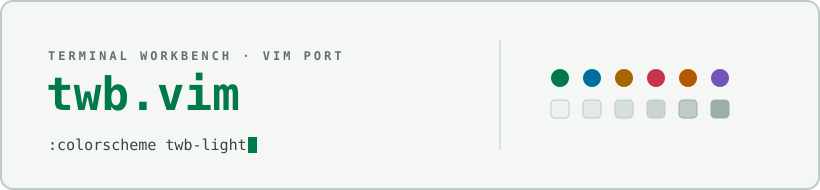

<picture>
  <source media="(prefers-color-scheme: dark)" srcset="docs/assets/cover-dark.svg" />
  
</picture>

# Terminal Workbench Suite

One repo for the whole Terminal Workbench family: the design system
(spec + tokens), every editor/terminal/browser port, and the official
monospace typeface. Calm graphite surfaces, restrained ANSI-style accents,
mandatory dark **and** light modes, color spent only on signal.

**Live demo:** <https://real-fruit-snacks.github.io/terminal-workbench-suite/>

## Get the theme

| App | How to install |
|---|---|
| **Obsidian** | Settings → Appearance → Themes → browse for **Terminal Workbench** ([standalone repo](https://github.com/Real-Fruit-Snacks/terminal-workbench)) |
| **Vim** | Grab `terminal-workbench-vim.zip` from [Releases](https://github.com/Real-Fruit-Snacks/terminal-workbench-suite/releases), drop `colors/` + `autoload/` into `~/.vim/` — see [ports/vim](ports/vim) |
| **VS Code** | Download the `.vsix` from [Releases](https://github.com/Real-Fruit-Snacks/terminal-workbench-suite/releases), then `code --install-extension terminal-workbench-*.vsix` — see [ports/vscode](ports/vscode) |
| **Brave** | `terminal-workbench-brave.zip` from [Releases](https://github.com/Real-Fruit-Snacks/terminal-workbench-suite/releases), load unpacked via `brave://extensions` — see [ports/brave](ports/brave) |
| **Notepad++** | `terminal-workbench-notepad-plus-plus.zip` from [Releases](https://github.com/Real-Fruit-Snacks/terminal-workbench-suite/releases), XMLs into your `themes\` folder — see [ports/notepad-plus-plus](ports/notepad-plus-plus) |
| **Windows Terminal** | Merge [`terminal-workbench.json`](ports/windows-terminal/terminal-workbench.json) into `settings.json` — see [ports/windows-terminal](ports/windows-terminal) |
| **Font** | `terminal-workbench-mono.zip` from [Releases](https://github.com/Real-Fruit-Snacks/terminal-workbench-suite/releases) — TTFs + webfonts, see [font/](font) |

## Build for the web

Drop the tokens into any page:

```html
<link rel="stylesheet" href="https://cdn.jsdelivr.net/gh/Real-Fruit-Snacks/terminal-workbench-suite@main/tokens/tokens.css">
```

Add [`tokens/fonts.css`](tokens/fonts.css) the same way for Terminal
Workbench Mono.

## Port it anywhere

[THEME-SPEC.md](THEME-SPEC.md) is the portable source of truth — philosophy,
token tables for both modes, typography, shape, motion, and component
patterns. Hand it to any tool (or AI) to reproduce the theme faithfully.

## Family map

- **This repo** — spec, tokens, demo, ports, font.
- [terminal-workbench](https://github.com/Real-Fruit-Snacks/terminal-workbench) — Obsidian theme (standalone for the community catalog).
- [terminal-workbench-pet](https://github.com/Real-Fruit-Snacks/terminal-workbench-pet) · [terminal-workbench-cursor](https://github.com/Real-Fruit-Snacks/terminal-workbench-cursor) — Obsidian companion plugins.

## Repository layout

```
THEME-SPEC.md   the portable spec (source of truth)
tokens/         drop-in CSS custom properties + font loader
index.html      live demo (GitHub Pages)
ports/          vim · vscode · brave · notepad-plus-plus · windows-terminal
font/           Terminal Workbench Mono — parametric engine + built fonts
```

## License

MIT for everything except the typeface, which is licensed under the
[SIL Open Font License](font/OFL.txt).
