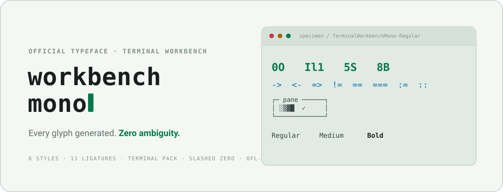

<div align="center">

<picture>
  <source media="(prefers-color-scheme: dark)" srcset="docs/assets/cover-dark.svg" />
  
</picture>

<br/>

  # Terminal Workbench Mono

  **The official monospace of the [Terminal Workbench design system](https://github.com/Real-Fruit-Snacks/terminal-workbench-suite). Every glyph is generated from a parametric Python engine: clean geometric letterforms, a slashed zero, unambiguous 0O / Il1 / 5S / 8B, and eleven coding ligatures.**

  [](OFL.txt)
  [](https://github.com/Real-Fruit-Snacks/terminal-workbench-suite/releases)
  

  [Live Specimen](https://real-fruit-snacks.github.io/terminal-workbench-suite/font/docs/) • [Design System](https://github.com/Real-Fruit-Snacks/terminal-workbench-suite) • [Report Issue](https://github.com/Real-Fruit-Snacks/terminal-workbench-suite/issues)

</div>

---

## Highlights

| | |
|---|---|
| **Styles** | Regular · Medium · Bold + matching italics (6 total) |
| **Glyphs** | A–Z, a–z, 0–9, full ASCII, Latin-1 accents (à é ñ ü ç …), smart quotes, dashes, math (`× ÷ ± ≠ ≤ ≥`), arrows, symbols (`© ® ™ € £ µ § ¶ ✓`) |
| **Terminal** | Box-drawing (light/heavy/double/rounded), block elements, shades, Powerline separators — full-cell, seamless tiling |
| **Ligatures** | `-> <- => != == === !== <= >= := ::` via standard `calt` + `liga`; `ss01` for a dotted zero |
| **Metrics** | True monospace — every glyph exactly one cell (600/1000 UPM) |
| **Formats** | TTF (desktop) · WOFF2 (web, ~5 KB per style) |
| **License** | [SIL Open Font License 1.1](OFL.txt) — free to use, modify and embed |

Full history in [CHANGELOG.md](CHANGELOG.md).

## Download

Grab **`terminal-workbench-mono.zip`** from the suite's
[**latest release**](https://github.com/Real-Fruit-Snacks/terminal-workbench-suite/releases) —
it bundles `dist/` (TTF + WOFF2, all six styles), `OFL.txt`, and this `README.md`.

Need the Obsidian snippet or the specimen site too? Clone the
[suite repo](https://github.com/Real-Fruit-Snacks/terminal-workbench-suite) and take
everything under `font/`, or build the whole family from source yourself — see
[Build from source](#build-from-source) below.

## Install

**Windows** — right-click each TTF → **Install**, or run the scripted per-user install:

```powershell
py tools/install_windows.py
```

**macOS** — open each TTF in Font Book → **Install Font**.

**Linux**

```bash
mkdir -p ~/.local/share/fonts/TerminalWorkbenchMono
cp *.ttf ~/.local/share/fonts/TerminalWorkbenchMono/
fc-cache -f
```

## Use with the Terminal Workbench design system

This font is the design system's official `--twb-font-mono` face. In a web
project, link the system's stylesheets and you get both the tokens and the
font:

```html
<link rel="stylesheet" href="https://cdn.jsdelivr.net/gh/Real-Fruit-Snacks/terminal-workbench-suite@main/tokens/fonts.css">
<link rel="stylesheet" href="https://cdn.jsdelivr.net/gh/Real-Fruit-Snacks/terminal-workbench-suite@main/tokens/tokens.css">
```

## Obsidian

1. Drop [`terminal-workbench-mono.css`](obsidian/terminal-workbench-mono.css) — one file, all six
   font styles are embedded in it — into `<vault>/.obsidian/snippets/`.
2. **Settings → Appearance → CSS snippets** → enable **terminal-workbench-mono**.

The snippet themes **all of Obsidian** — interface, note text, and code (with
ligatures) — in any vault, on any machine, no font install required. Each
numbered section in the file can be commented out independently, e.g. keep
your UI font but write notes in Terminal Workbench Mono. Prefer the built-in
way? Install the TTFs and pick the font under **Settings → Appearance → Font**
(restart Obsidian after installing so it appears in the list).

> Why embedded? Obsidian resolves `url()` in snippet CSS against the app, not
> the snippets folder, so a snippet can't reference font files sitting next to
> it. Base64-embedding sidesteps that.

## Web

The [`docs/`](docs/) folder is the published specimen site. Reuse the stylesheet
anywhere:

```html
<link rel="stylesheet" href="terminal-workbench-mono.css">
<style> code, pre { font-family: "Terminal Workbench Mono", monospace; } </style>
```

### Published notes sites (Quartz, MkDocs, Hugo…)

Hosting your vault as a static site? Copy `dist/webfonts/*.woff2` and
`docs/terminal-workbench-mono.css` into the site's static assets and point code at the font:

```css
/* Quartz: custom.scss · MkDocs Material: docs/stylesheets/extra.css · etc. */
@import url("/terminal-workbench-mono.css");    /* or copy the @font-face rules in */
:root { --font-monospace: "Terminal Workbench Mono", ui-monospace, monospace; }
code, pre, kbd, .cm-editor { font-family: "Terminal Workbench Mono", ui-monospace, monospace;
  font-feature-settings: "calt" 1, "liga" 1; }   /* keep coding ligatures on */
```

That keeps your published notes visually identical to your local vault.

## Host it yourself

The specimen site is fully self-contained — no CDNs, no build step, works
with no internet access. It's already live via the suite's GitHub Pages at
[real-fruit-snacks.github.io/terminal-workbench-suite/font/docs/](https://real-fruit-snacks.github.io/terminal-workbench-suite/font/docs/)
— GitHub Pages serves the whole `terminal-workbench-suite` tree, so this font
needs no separate deployment of its own. To host it elsewhere, copy the
`docs/` folder and serve it from any static web server.

## Build from source

The font is generated, not hand-drawn — every glyph is Python.

```
tools/
  glyphlab.py    parametric geometry engine (strokes, corners, box-rings)
  glyphs.py      core glyph definitions + base ligatures
  glyphs_more.py accented letters, symbols, extra ligatures, dotted zero
  box_glyphs.py  box-drawing, block elements, shades, Powerline
  build.py       compiles 6 styles to TTF + WOFF2 (fontTools): gasp/prep/STAT
  validate.py    monospace / naming / metrics / GSUB checks
  package.py     release archives + SHA256SUMS    make_obsidian_snippet.py
  proof.py · proof_ext.py · chart.py · zoom.py · closeup.py   QA renders
  og_image.py    specimen social card + favicon
  check_gsub.py  dumps ligature rules    check_strings.py  scans name tables
  install_windows.py  per-user Windows install
```

```bash
pip install -r requirements.txt
py tools/build.py        # -> dist/ttf + dist/webfonts (6 styles)
py tools/validate.py     # -> ALL PASS
fontbakery check-universal --error-code-on FAIL dist/ttf/*.ttf   # 0 FAIL
```

Want a heavier weight, wider cut or rounder corners? The whole family falls out
of three numbers per style — `w` (stroke weight), `cut` (corner radius), `segs`
(corner smoothing) — in `build.py`. Change them and rebuild.

## Design notes

- **Slashed zero, footed one, tailed ell, serifed cap-I** — hashes, IPs and
  base64 stay unambiguous at 2 a.m.
- **Large x-height, open counters** — holds up at 12 px in a packed terminal.
- The italics are obliques cut at 8° from the same skeletons, so weights and
  spacing match the uprights exactly.
- The `preview/` folder documents the design exploration — three candidate
  directions were rendered from the same skeletons before this one was chosen.

## License

[SIL Open Font License 1.1](OFL.txt). Use it, ship it, modify it — just don't
sell the font files by themselves, and use a different name for forks
("Terminal Workbench Mono" is reserved).

---

Designed & built 2026 by **Real-Fruit-Snacks**. Fork it, re-cut it, sail on.
