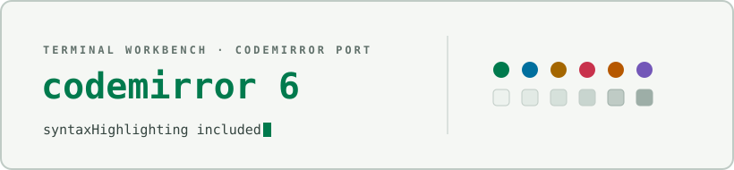

<div align="center">

<picture>
  <source media="(prefers-color-scheme: dark)" srcset="docs/assets/cover-dark.svg" />
  
</picture>

</div>

# Terminal Workbench for CodeMirror

A single source-only ESM module implementing the [Terminal Workbench
design system](https://github.com/Real-Fruit-Snacks/terminal-workbench-suite)
for [CodeMirror 6](https://codemirror.net/): an `EditorView.theme` for
editor chrome (gutter, active line, selection, search match, panels,
tooltips) and a `HighlightStyle` for syntax highlighting, in dark and
light variants.

## Files

```
terminal-workbench.mjs   CM6 theme + highlight style, dark and light, six named exports
```

## Install

Requires CodeMirror 6's `@codemirror/view`, `@codemirror/language`, and
`@lezer/highlight` packages as peer dependencies — already part of any
CM6 setup. There's no npm package for this port; copy
`terminal-workbench.mjs` into your project:

```
git clone https://github.com/Real-Fruit-Snacks/terminal-workbench-suite
cp terminal-workbench-suite/ports/codemirror/terminal-workbench.mjs your-project/src/
```

Then spread the combined extension into your editor state:

```js
import { EditorState } from '@codemirror/state';
import { EditorView } from '@codemirror/view';
import { terminalWorkbenchDark } from './terminal-workbench.mjs';

const state = EditorState.create({
  doc: 'console.log("hello")',
  extensions: [...terminalWorkbenchDark],
});

new EditorView({ state, parent: document.body });
```

Use `terminalWorkbenchLight` for the light variant.

**Release package:** each [release](https://github.com/Real-Fruit-Snacks/terminal-workbench-suite/releases)
ships `terminal-workbench-codemirror.zip`, an archive of
`terminal-workbench.mjs` and this README.

## Exports

| Export | Type | Contents |
|---|---|---|
| `terminalWorkbenchDarkTheme` | `Extension` (`EditorView.theme`) | dark editor chrome |
| `terminalWorkbenchDarkHighlight` | `HighlightStyle` | dark syntax colors |
| `terminalWorkbenchLightTheme` | `Extension` (`EditorView.theme`) | light editor chrome |
| `terminalWorkbenchLightHighlight` | `HighlightStyle` | light syntax colors |
| `terminalWorkbenchDark` | `Extension[]` | `[terminalWorkbenchDarkTheme, syntaxHighlighting(terminalWorkbenchDarkHighlight)]` |
| `terminalWorkbenchLight` | `Extension[]` | `[terminalWorkbenchLightTheme, syntaxHighlighting(terminalWorkbenchLightHighlight)]` |

Use the combined `terminalWorkbenchDark` / `terminalWorkbenchLight` arrays
for the normal case; the theme and highlight style are also exported
individually if you want to mix in a different syntax scheme or chrome.

## Notes

- Syntax colors follow the suite's canonical mapping (mirrored from the
  VS Code port's token table): comments text-muted, strings accent,
  functions and types accent-alt, keywords violet, numbers/booleans/atoms
  orange, properties and attributes warm, tags red, headings accent
  (bold), links accent-alt, invalid red.
- `.cm-selectionBackground` uses the palette's editor selection tone,
  distinct from the terminal ports' selection color.

## See also

- [Suite root README](../../README.md) — overview of every port.
- [`THEME-SPEC.md`](../../THEME-SPEC.md) — the full portable design
  specification this theme implements.

## License

Released under the [MIT License](../../LICENSE).
