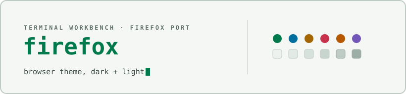

<div align="center">

<picture>
  <source media="(prefers-color-scheme: dark)" srcset="docs/assets/cover-dark.svg" />
  
</picture>

</div>

# Terminal Workbench for Firefox

A manifest v2 static theme implementing the [Terminal Workbench design
system](https://github.com/Real-Fruit-Snacks/terminal-workbench-suite) for
Firefox: frame, tab strip, address bar, popups, and sidebar colors, in dark
and light variants. Companion to the [Brave port](../brave/), reusing the
same chrome roles so the two browsers match.

## Files

```
terminal-workbench-dark/manifest.json    dark theme, WebExtension manifest v2
terminal-workbench-light/manifest.json   light theme, WebExtension manifest v2
```

Each folder is a complete, installable extension on its own — there is no
build step; the manifests are the shipped artifact.

## Install

**Temporary (for trying it out):** open `about:debugging#/runtime/this-firefox`,
click **Load Temporary Add-on**, and select the `manifest.json` inside
whichever folder you want (`terminal-workbench-dark` or
`terminal-workbench-light`). Firefox applies the theme immediately. This is
temporary by design — Firefox unloads it on restart, and it needs to be
reloaded from `about:debugging` each session.

**Permanent:** Firefox requires every add-on to be signed by Mozilla before
it can be installed permanently, including unlisted, self-distributed
themes. There is no unsigned/developer-mode path to a persistent install as
there is in Chromium browsers. To get a permanent build:

1. Create a free account at [addons.mozilla.org](https://addons.mozilla.org).
2. Zip the contents of the folder you want (`terminal-workbench-dark` or
   `terminal-workbench-light` — zip the folder's contents, not the folder
   itself) and submit it for **unlisted** signing through the developer
   hub.
3. Download the signed `.xpi` Mozilla returns and install it by dragging it
   into a Firefox window, or via `about:addons` → the gear menu → **Install
   Add-on From File**.

See Mozilla's [Extension Workshop signing
guide](https://extensionworkshop.com/documentation/publish/signing-and-distribution-overview/)
for the current process and requirements. This repository does not publish
a signed build — signing is tied to a Mozilla developer account, so it has
to be the installing user's own.

**Release package:** each [release](https://github.com/Real-Fruit-Snacks/terminal-workbench-suite/releases)
ships `terminal-workbench-firefox.zip`, an archive of both manifest folders
and this README. It still needs to go through the temporary or signed
install path above — the release zip is not itself signed.

## Switching and removing

Firefox allows one theme at a time: loading the other variant replaces the
current one. Remove or disable it from `about:addons` → **Themes**, or
select the default theme there to revert.

## Scope

A Firefox static theme styles the browser frame, tab strip, toolbar and
address bar, popups/menus, sidebar, and New Tab Page colors. It cannot
affect web page content or the internal `about:` pages beyond New Tab.

## See also

- [Suite root README](../../README.md) — overview of every port.
- [`THEME-SPEC.md`](../../THEME-SPEC.md) — the full portable design
  specification this theme implements.
- [Brave port](../brave/) — the same chrome roles for Chromium browsers.

## License

Released under the [MIT License](../../LICENSE).
