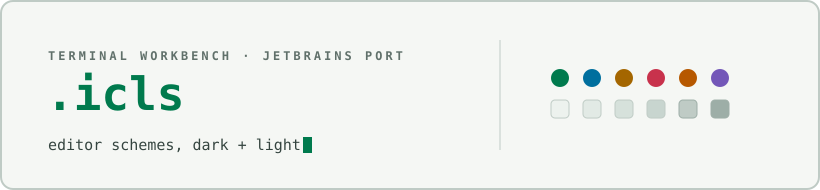

<div align="center">

<picture>
  <source media="(prefers-color-scheme: dark)" srcset="docs/assets/cover-dark.svg" />
  
</picture>

</div>

# Terminal Workbench for JetBrains IDEs

Dark and light `.icls` editor color schemes implementing the Terminal
Workbench design system, for any JetBrains IDE (IntelliJ IDEA, PyCharm,
WebStorm, GoLand, Rider, CLion, and the rest of the family). Generated
from the same palette as the rest of the suite.

See the [suite root README](../../README.md) for an overview of every
port, and [`THEME-SPEC.md`](../../THEME-SPEC.md) for the full portable
design specification these schemes implement.

## Contents

```
jetbrains/
├── Terminal Workbench Dark.icls
└── Terminal Workbench Light.icls
```

## Install

1. Open **Settings/Preferences → Editor → Color Scheme**.
2. Click the gear icon next to the scheme dropdown and choose **Import
   Scheme… → IntelliJ IDEA color scheme (.icls)**.
3. Select `Terminal Workbench Dark.icls` or `Terminal Workbench
   Light.icls` and confirm the import.
4. Pick **Terminal Workbench Dark** or **Terminal Workbench Light** from
   the color scheme dropdown.

Repeat the import for the other file to have both variants available.

**Release package:** each [release](https://github.com/Real-Fruit-Snacks/terminal-workbench-suite/releases)
ships `terminal-workbench-jetbrains.zip`, an archive of both `.icls`
files and this README.

## Notes

- These schemes theme the editor only (syntax highlighting, gutter,
  console/ANSI colors, search and diff highlights). They don't change
  the IDE's window chrome, so pair `Terminal Workbench Dark` with the
  IDE's built-in **Dark** UI theme and `Terminal Workbench Light` with
  the built-in **Light**/**Default** UI theme for a consistent look.
- Dark inherits unset attributes from `Darcula`; Light inherits from
  `Default`, so anything not explicitly listed above falls back to
  those built-in schemes.

## License

Released under the [MIT License](../../LICENSE).
