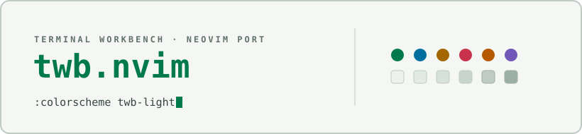

<div align="center">

<picture>
  <source media="(prefers-color-scheme: dark)" srcset="docs/assets/cover-dark.svg" />
  
</picture>

</div>

# Terminal Workbench for Neovim

A native Lua colorscheme — `twb-dark` and `twb-light` — porting the
[Terminal Workbench design system](https://github.com/Real-Fruit-Snacks/terminal-workbench-suite):
calm graphite surfaces, restrained ANSI-style accents, quiet chrome with
color reserved for signal. Covers core editor UI, classic syntax groups,
Treesitter captures, LSP diagnostics, diffs, and a handful of common
plugins (gitsigns.nvim, telescope.nvim, nvim-tree.lua, which-key.nvim,
lazy.nvim).

## Files

```
colors/twb-dark.lua    colorscheme entry point (dark)
colors/twb-light.lua   colorscheme entry point (light)
lua/twb/palette.lua    dark/light token tables
lua/twb/theme.lua       highlight-group builder, applied by both entry points
```

## Install

Requires Neovim 0.8+ (uses `vim.api.nvim_set_hl`). A true-color terminal
(`vim.o.termguicolors = true`) is required for accurate colors.

**Manual copy:** clone the suite, then copy `colors/` and `lua/twb/` into
your Neovim config directory (`stdpath("config")` — `~/.config/nvim` on
Linux/macOS, `~/AppData/Local/nvim` on Windows):

    git clone https://github.com/Real-Fruit-Snacks/terminal-workbench-suite
    cp -r terminal-workbench-suite/ports/neovim/colors ~/.config/nvim/
    cp -r terminal-workbench-suite/ports/neovim/lua/twb ~/.config/nvim/lua/

**Release package:** each [release](https://github.com/Real-Fruit-Snacks/terminal-workbench-suite/releases)
ships `terminal-workbench-neovim.zip`, an archive of just the theme itself —
`colors/`, `lua/`, and `README.md`.

**lazy.nvim**, pointed at a clone of the suite:

```lua
{
  dir = "~/src/terminal-workbench-suite/ports/neovim",
  name = "terminal-workbench",
  lazy = false,
  priority = 1000,
  config = function()
    vim.o.termguicolors = true
    vim.cmd.colorscheme("twb-dark") -- or "twb-light"
  end,
}
```

## Use

```lua
vim.o.termguicolors = true
vim.cmd.colorscheme("twb-dark") -- or "twb-light"
```

## Notes

- No italics anywhere; diagnostics use undercurl.
- `:terminal` gets a matching ANSI palette (`g:terminal_color_0..15`).
- See the root [README](../../README.md) and
  [THEME-SPEC.md](../../THEME-SPEC.md) for the full design system.

## License

MIT, same as the source design system.
