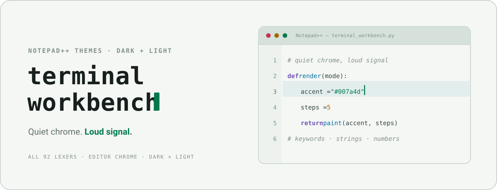

<picture>
  <source media="(prefers-color-scheme: dark)" srcset="docs/assets/cover-dark.svg" />
  
</picture>

 

Dark and light Notepad++ themes implementing the Terminal Workbench design system — calm graphite surfaces, restrained ANSI-style accents, and color spent only on signal.

 

&nbsp;
&nbsp;

[Design system](https://github.com/Real-Fruit-Snacks/terminal-workbench-suite) · [Install](#install) · [Report an issue](https://github.com/Real-Fruit-Snacks/terminal-workbench-suite/issues)

---

## Overview

Keywords violet, strings green, functions cyan, numbers orange, comments faint italic — and everything else stays quiet graphite. Both themes cover all 92 languages Notepad++ ships lexers for, plus every editor widget style: selection, caret, current line, folds, margins, find marks, smart highlighting, change history, and tabs.

| Theme | Base | Accent |
|---|---|---|
| `Terminal Workbench Dark.xml` | `#090C0D` graphite | `#63F2AB` mint |
| `Terminal Workbench Light.xml` | `#F5F7F4` paper | `#007A4D` green |

## Install

1. Download both theme XML files from the [latest release](https://github.com/Real-Fruit-Snacks/terminal-workbench-suite/releases) (or clone the suite repo and grab them from `ports/notepad-plus-plus/`).
2. Copy them into your themes folder:
   - Installed Notepad++: `%AppData%\Notepad++\themes\`
   - Portable Notepad++: `<Notepad++ folder>\themes\`
3. Restart Notepad++, then pick the theme under **Settings → Style Configurator → Select theme**.

For the dark theme, also enabling **Settings → Preferences → Dark Mode** makes the surrounding window chrome match.

## Token mapping

| Notepad++ style | Terminal Workbench token | Dark | Light |
|---|---|---|---|
| Keywords, instructions | violet | `#B78CFF` | `#7357B8` |
| Strings, characters | accent | `#63F2AB` | `#007A4D` |
| Functions, preprocessor | accent-alt | `#6BDCFF` | `#006F9E` |
| Numbers, values | orange | `#F7A35C` | `#B65800` |
| Types, attributes, regex | warm | `#F0C674` | `#A46600` |
| Errors, tags, deletions | red | `#FF6E7A` | `#C8324C` |
| Comments | text-faint, italic | `#63736F` | `#81918A` |
| Code default | text-soft | `#B4C3BD` | `#34443F` |

Selections, current-line, smart highlighting, and find marks use tints pre-mixed from the accents over the page background, exactly as the [design spec](../../THEME-SPEC.md) derives them.

## License

[MIT](../../LICENSE)
