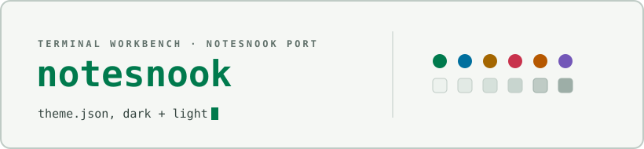

<div align="center">

<picture>
  <source media="(prefers-color-scheme: dark)" srcset="docs/assets/cover-dark.svg" />
  
</picture>

</div>

# Terminal Workbench for Notesnook

Two themes — `Terminal Workbench Dark` and `Terminal Workbench Light` —
implementing the [Terminal Workbench design
system](https://github.com/Real-Fruit-Snacks/terminal-workbench-suite) for
the [Notesnook](https://notesnook.com) note app: calm graphite surfaces,
restrained ANSI-style accents, quiet chrome with color reserved for signal.

Every Notesnook scope is covered — title bar, status bar, navigation menu,
note list, editor, editor toolbar, editor sidebar, dialogs, context menus,
and the mobile bottom sheets.

## Files

```
terminal-workbench-dark.json    dark theme  (colorScheme: dark)
terminal-workbench-light.json   light theme (colorScheme: light)
```

Both are `compatibilityVersion: 1` themes and validate against the
[official v1 schema](https://raw.githubusercontent.com/streetwriters/notesnook-themes/main/schemas/v1.schema.json),
which they reference via `$schema`.

## Install

Works the same on desktop, web, and mobile:

1. **Settings → Appearance → Themes**.
2. Press **Load from file**.
3. Pick `terminal-workbench-dark.json` or `terminal-workbench-light.json`.
4. Press **Set as default**.

Load the dark file as your dark theme and the light file as your light
theme, and Notesnook will follow the system color scheme.

**Release package:** each [release](https://github.com/Real-Fruit-Snacks/terminal-workbench-suite/releases)
ships `terminal-workbench-notesnook.zip`, an archive of both theme files
and this README.

## Notes

- **Scope layering.** `base` carries the full token set; every other scope
  overrides only what it needs and inherits the rest, so the graphite ramp
  stays consistent. Surfaces step away from the page in the direction the
  spec requires — lighter in dark mode, darker in light mode.
- **Light mode is not an inversion.** Accents darken (`#63f2ab` → `#007a4d`),
  and chrome labels step from `text-muted` up to `text-soft`, because muted
  graphite only clears WCAG AA down to one surface step in light mode.
  Every paragraph and heading color in both files clears 4.5:1 against its
  own background *and* its hover fill; icons clear 3:1. Placeholder and
  `disabled` colors are deliberately below that — they signal
  unavailability.
- **Semantic fills.** `error` and `success` backgrounds are the accent mixed
  into the page (9% in dark, 3% in light — the light fill stays shallower so
  the colored text on it keeps its contrast). Their borders are the spec's
  `mix(color, border, 34%)` recipe.
- **No syntax colors.** Notesnook's theme schema covers UI surfaces only;
  code-block syntax highlighting is not themable from a `theme.json`.

## Publishing to the Notesnook theme store

The [themes repository](https://github.com/streetwriters/notesnook-themes)
expects one file per theme at `themes/{theme-id}/v1/theme.json`, so these
files map to `themes/terminal-workbench-dark/v1/theme.json` and
`themes/terminal-workbench-light/v1/theme.json`. Bump the `version` field on
every change or existing installs won't see the update.

## See also

- [Suite root README](../../README.md) — overview of every port.
- [`THEME-SPEC.md`](../../THEME-SPEC.md) — the full portable design
  specification this theme implements.

## License

Released under the [MIT License](../../LICENSE).
