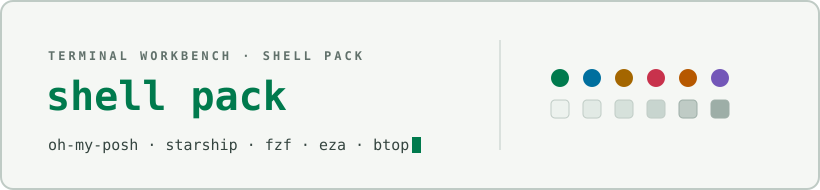

<div align="center">

<picture>
  <source media="(prefers-color-scheme: dark)" srcset="docs/assets/cover-dark.svg" />
  
</picture>

</div>

# Terminal Workbench for shell prompts and CLI tools

Dark and light Terminal Workbench configs for five shell-adjacent tools:
[oh-my-posh](#oh-my-posh), [starship](#starship), [fzf](#fzf), [eza](#eza),
and [btop](#btop). Each config is generated from the same palette as the
rest of the suite.

See the [suite root README](../../README.md) for an overview of every
port, and [`THEME-SPEC.md`](../../THEME-SPEC.md) for the full portable
design specification these configs implement.

## Contents

```
shell/
├── terminal-workbench.omp.json                oh-my-posh (dark + light share one prompt)
├── starship-terminal-workbench.toml            starship (dark + light palettes, one file)
├── fzf-terminal-workbench-dark.sh
├── fzf-terminal-workbench-light.sh
├── eza-theme.yml                               eza (dark-oriented, see note below)
└── btop/
    ├── terminal-workbench-dark.theme
    └── terminal-workbench-light.theme
```

## Install

### oh-my-posh

File: [`terminal-workbench.omp.json`](terminal-workbench.omp.json)

1. Copy the file anywhere on disk, e.g. `~/.config/oh-my-posh/terminal-workbench.omp.json`.
2. Point your shell's init at it:
   ```sh
   eval "$(oh-my-posh init bash --config ~/.config/oh-my-posh/terminal-workbench.omp.json)"
   ```
   Swap `bash` for `zsh`, `fish`, or `pwsh` as needed (PowerShell:
   `oh-my-posh init pwsh --config ~/.config/oh-my-posh/terminal-workbench.omp.json | Invoke-Expression`).
3. The prompt is one palette: path segment, git segment (turns warm on
   uncommitted changes), an exit-code segment that only appears after a
   failing command, and a plain `❯` that turns red on error. No powerline
   or Nerd Font glyphs are required — segments are set to plain text style.

### starship

File: [`starship-terminal-workbench.toml`](starship-terminal-workbench.toml)

1. Merge this file's contents into `~/.config/starship.toml` (or point
   `STARSHIP_CONFIG` at a copy of it: `export STARSHIP_CONFIG=~/.config/starship/terminal-workbench.toml`).
2. The file ships both `[palettes.terminal_workbench_dark]` and
   `[palettes.terminal_workbench_light]`; the top-level `palette` key
   selects which one is active. Change:
   ```toml
   palette = "terminal_workbench_dark"
   ```
   to `terminal_workbench_light` to switch modes.
3. Only `directory`, `git_branch`, `git_status`, `cmd_duration`, and
   `character` are overridden — everything else keeps starship's defaults.

### fzf

Files: [`fzf-terminal-workbench-dark.sh`](fzf-terminal-workbench-dark.sh),
[`fzf-terminal-workbench-light.sh`](fzf-terminal-workbench-light.sh)

1. Copy the file for your mode anywhere on disk, e.g. `~/.config/fzf/`.
2. Source it from your shell rc file, after fzf's own setup:
   ```sh
   source ~/.config/fzf/fzf-terminal-workbench-dark.sh
   ```
   (or the `-light.sh` file). Each just exports `FZF_DEFAULT_OPTS` with a
   `--color=...` spec.

### eza

File: [`eza-theme.yml`](eza-theme.yml)

1. Copy it to `~/.config/eza/theme.yml` (or set `EZA_CONFIG_DIR` to a
   directory containing it). eza picks up `theme.yml` automatically —
   no flag needed.
2. This theme is dark-oriented only: it's tuned for a dark terminal
   background and isn't mirrored with a light variant, unlike the other
   four tools in this pack.

### btop

Files: [`btop/terminal-workbench-dark.theme`](btop/terminal-workbench-dark.theme),
[`btop/terminal-workbench-light.theme`](btop/terminal-workbench-light.theme)

1. Copy both files into btop's theme directory, typically
   `~/.config/btop/themes/`.
2. In btop, open the options menu (<kbd>Esc</kbd> or the menu button),
   go to **color theme**, and select **terminal-workbench-dark** or
   **terminal-workbench-light**.

## License

Released under the [MIT License](../../LICENSE).
