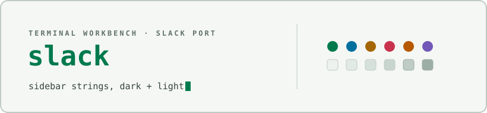

<div align="center">

<picture>
  <source media="(prefers-color-scheme: dark)" srcset="docs/assets/cover-dark.svg" />
  
</picture>

</div>

# Terminal Workbench for Slack

Custom theme strings implementing the Terminal Workbench design system for Slack in dark and light variants.

## Files

```
terminal-workbench-dark.txt    dark theme string
terminal-workbench-light.txt   light theme string
```

## Install

1. Open Slack and go to **Preferences → Themes**.
2. Scroll to the bottom to find the **Custom Theme** input field.
3. Copy the entire contents of either `terminal-workbench-dark.txt` or `terminal-workbench-light.txt`.
4. Paste the string into the custom theme field and press Enter.

### Dark

```
#0E1214,#13191C,#63F2AB,#07100D,#182024,#DCE4DF,#63F2AB,#FF6E7A,#0E1214,#DCE4DF
```

### Light

```
#EDF2EE,#E2EAE5,#007A4D,#F9FBF8,#D6E1DB,#17201D,#007A4D,#C8324C,#EDF2EE,#17201D
```

## See also

- [Suite root README](../../README.md) — overview of every port.
- [`THEME-SPEC.md`](../../THEME-SPEC.md) — the full portable design specification this theme implements.

## License

Released under the [MIT License](../../LICENSE).
