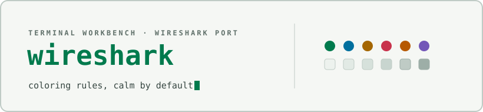

<div align="center">

<picture>
  <source media="(prefers-color-scheme: dark)" srcset="docs/assets/cover-dark.svg" />
  
</picture>

</div>

# Terminal Workbench for Wireshark

Dark and light Wireshark coloring-rule profiles implementing the Terminal
Workbench design system: thirteen coloring rules covering common TCP/HTTP/
TLS/DNS/routing/ICMP/ARP conditions, generated from the same palette as the
rest of the suite.

See the [suite root README](../../README.md) for an overview of every
port, and [`THEME-SPEC.md`](../../THEME-SPEC.md) for the full portable
design specification these profiles implement.

## Contents

```
wireshark/
├── Terminal Workbench Dark/colorfilters
└── Terminal Workbench Light/colorfilters
```

## Install

1. In Wireshark, open **Help → About Wireshark → Folders**, and note the
   **Personal configuration** path.
2. Copy the `Terminal Workbench Dark` folder (and/or `Terminal Workbench
   Light`) into that path's `profiles/` subfolder, so you end up with
   `<Personal configuration>/profiles/Terminal Workbench Dark/colorfilters`.
3. In the bottom-right corner of the Wireshark window, click the current
   profile name and select **Terminal Workbench Dark** or **Terminal
   Workbench Light**.

**Release package:** each [release](https://github.com/Real-Fruit-Snacks/terminal-workbench-suite/releases)
ships `terminal-workbench-wireshark.zip`, an archive of both profile
folders and this README.

## Notes

- These profiles set coloring rules only; they don't change Wireshark's
  own window chrome. Pair `Terminal Workbench Dark` with Wireshark's
  built-in dark UI (**View → Appearance** on most platforms, or your OS
  theme) for a consistent look, and `Terminal Workbench Light` with a
  light UI.
- Each profile's `colorfilters` file uses only the coloring rules listed
  above; all other profile preferences (columns, layout, etc.) stay at
  Wireshark's defaults unless you set them yourself.

## License

Released under the [MIT License](../../LICENSE).
