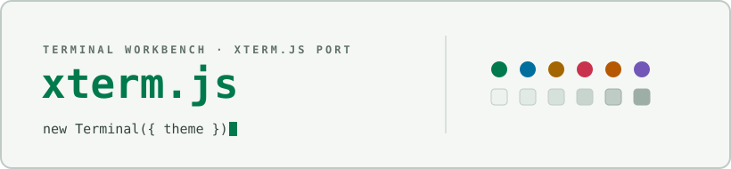

<div align="center">

<picture>
  <source media="(prefers-color-scheme: dark)" srcset="docs/assets/cover-dark.svg" />
  
</picture>

</div>

# Terminal Workbench for xterm.js

Dark and light [`ITheme`](https://xtermjs.org/docs/api/terminal/interfaces/itheme/)
objects implementing the [Terminal Workbench design
system](https://github.com/Real-Fruit-Snacks/terminal-workbench-suite) for
[xterm.js](https://xtermjs.org), the terminal emulator component used to
embed a live terminal in a web page — the same kind of embedding a
browser-based console app (a Tidepool- or Riptide-style web terminal, for
example) wires up. Covers the full 16-color ANSI palette plus background,
foreground, cursor, and selection.

## Files

```
terminal-workbench-dark.json    dark ITheme, plain JSON
terminal-workbench-light.json   light ITheme, plain JSON
index.mjs                       ESM module exporting terminalWorkbenchDark / terminalWorkbenchLight
```

## Install

Requires xterm.js 5.x (the `@xterm/xterm` package), which reads theme
colors through the `ITheme` interface.

**From the ESM module:**

```js
import { Terminal } from '@xterm/xterm';
import { terminalWorkbenchDark } from './terminal-workbench-suite/ports/xtermjs/index.mjs';

const term = new Terminal({ theme: terminalWorkbenchDark });
```

Use `terminalWorkbenchLight` for the light variant.

**From the JSON files:** any bundler that resolves JSON imports (webpack,
Vite, esbuild) can import `terminal-workbench-dark.json` /
`terminal-workbench-light.json` directly as a plain object and pass it as
`theme`. This is also the file to reach for from non-JS consumers (build
scripts, config generators) that just need the color values.

**Release package:** each [release](https://github.com/Real-Fruit-Snacks/terminal-workbench-suite/releases)
ships `terminal-workbench-xtermjs.zip`, an archive of both JSON files,
`index.mjs`, and this README.

## Notes

- `index.mjs` defines `terminalWorkbenchDark` and `terminalWorkbenchLight`
  inline rather than importing the `.json` files — JSON import syntax is
  still runtime-dependent across bundlers and Node versions, so the two
  objects are duplicated by design. Their values match the `.json` files
  exactly; treat the JSON files as the canonical data and `index.mjs` as
  the drop-in path for bundled apps.
- `selectionBackground` and `selectionInactiveBackground` share one value:
  the palette defines a single terminal selection tone rather than
  separate focused/unfocused shades.
- `cursorAccent` is the text color drawn inside a block cursor, not a
  second accent color.

## See also

- [Suite root README](../../README.md) — overview of every port.
- [`THEME-SPEC.md`](../../THEME-SPEC.md) — the full portable design
  specification these themes implement.

## License

Released under the [MIT License](../../LICENSE).
