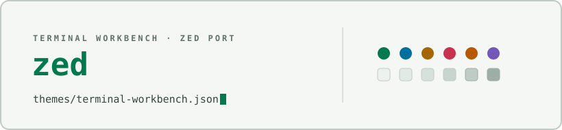

<div align="center">

<picture>
  <source media="(prefers-color-scheme: dark)" srcset="docs/assets/cover-dark.svg" />
  
</picture>

</div>

# Terminal Workbench for Zed

A single theme family — `Terminal Workbench Dark` and `Terminal Workbench
Light` — implementing the [Terminal Workbench design
system](https://github.com/Real-Fruit-Snacks/terminal-workbench-suite) for
the [Zed](https://zed.dev) editor: calm graphite surfaces, restrained
ANSI-style accents, quiet chrome with color reserved for signal. Covers
editor chrome, gutter, tabs, panels, the integrated terminal (full
16-color ANSI palette), and syntax highlighting.

## Files

```
themes/terminal-workbench.json   theme family: both Dark and Light variants
```

## Install

Requires the Zed theme JSON schema v0.2.0 (current Zed releases).

**Manual copy:** clone the suite, then copy the theme file into Zed's
themes directory (`~/.config/zed/themes/` on Linux/macOS,
`%AppData%\Zed\themes\` on Windows):

    git clone https://github.com/Real-Fruit-Snacks/terminal-workbench-suite
    mkdir -p ~/.config/zed/themes
    cp terminal-workbench-suite/ports/zed/themes/terminal-workbench.json ~/.config/zed/themes/

**Release package:** each [release](https://github.com/Real-Fruit-Snacks/terminal-workbench-suite/releases)
ships `terminal-workbench-zed.zip`, an archive of just `themes/` and this
README.

Then open the theme selector (`theme selector: toggle` in the command
palette, or **Settings → Theme**) and choose **Terminal Workbench Dark** or
**Terminal Workbench Light**.

## Notes

- Both variants ship in one file, as Zed expects for a theme family; the
  file carries no comments (JSON has none), so the family name and author
  fields in the file itself are the identity markers.
- The integrated terminal uses the suite's full 16-color ANSI palette.

## See also

- [Suite root README](../../README.md) — overview of every port.
- [`THEME-SPEC.md`](../../THEME-SPEC.md) — the full portable design
  specification this theme implements.

## License

Released under the [MIT License](../../LICENSE).
